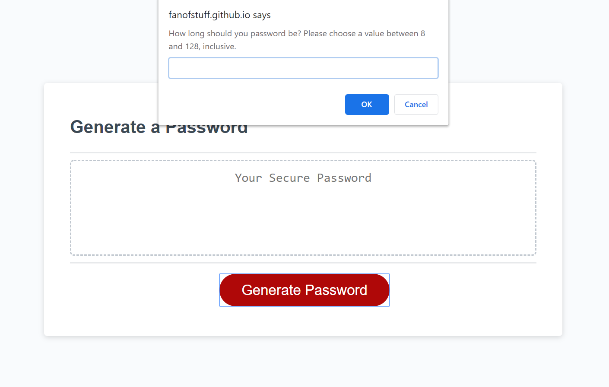
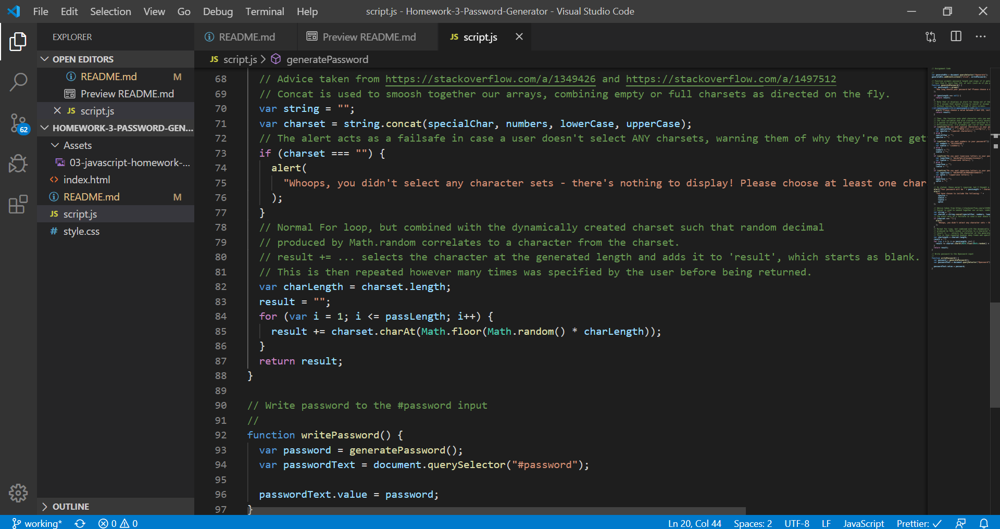

# 03 JavaScript: Password Generator

This program is intended to dynamically generate a password of varying lengths based on a user-defined character set. Specifically, users can choose to generate passwords between 8 and 128 characters long using any combination of numbers, lowercase letters, uppercase letters, and special characters. 

## Intended Usage

According to the user story that came bundled with this project, the intent of this program is to provide an employee with access to sensitive information a way to randomly generate passwords that they can then use to deter would-be information thieves. In reality, of course, using something like Math.random as the basis for this kind of security is just asking for trouble nowadays. Still, for a more mundane usage - deterring one's snoopy cubicle-neighbor from accessing your computer, say - this could be useful. 

## Screenshots

## Features

- Randomized character generator that dynamically accounts for included character sets
- Detects and responds to common errors, such as inputting an unsupported password length
- Prints password directly to text box, allowing for easy copying
- Automatically resets password creation function, allowing continuous password creation without refreshing
- Cancel the initial prompt with one click, allowing you to avoid redundant textboxes where possible

## Link to Published Page

(https://fanofstuff.github.io/Homework-3-Password-Generator/)

## Example

## How to Use

1. Open up the provided index.html file in your default browser. 
2. Click the Generate Password button. 
3. Enter your desired password length between 8 and 128, inclusive. 
4. Select which character sets you'd like to use for generation: 
    - Click Okay to include the current character set
    - Click Cancel or press the escape key to skip the current character set
    - Note: you must include at least one character set! 
5. The program will confirm your selected settings. 
6. Profit! Your randomly generated password will be displayed within the text area. 

## Credits

Advice taken from https://stackoverflow.com/a/1349426 and https://stackoverflow.com/a/1497512 for creating the random number generator/password creation mechanic. 

© 2019 fanofstuff